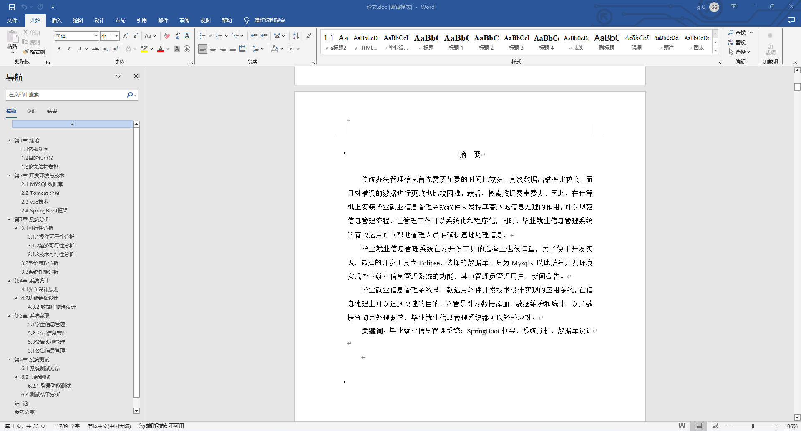
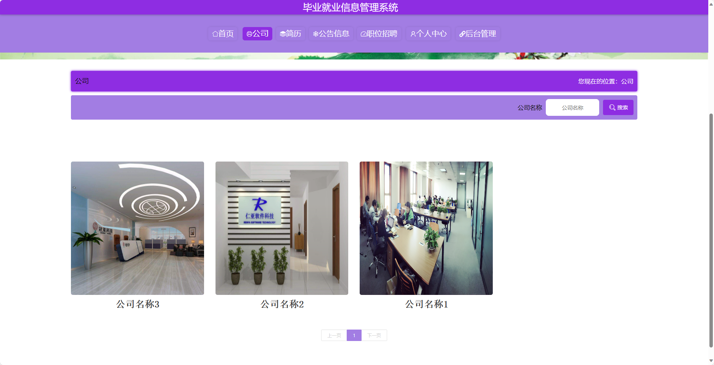
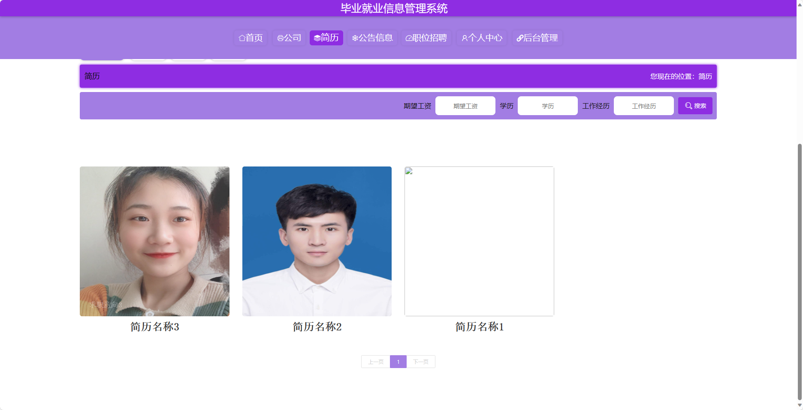
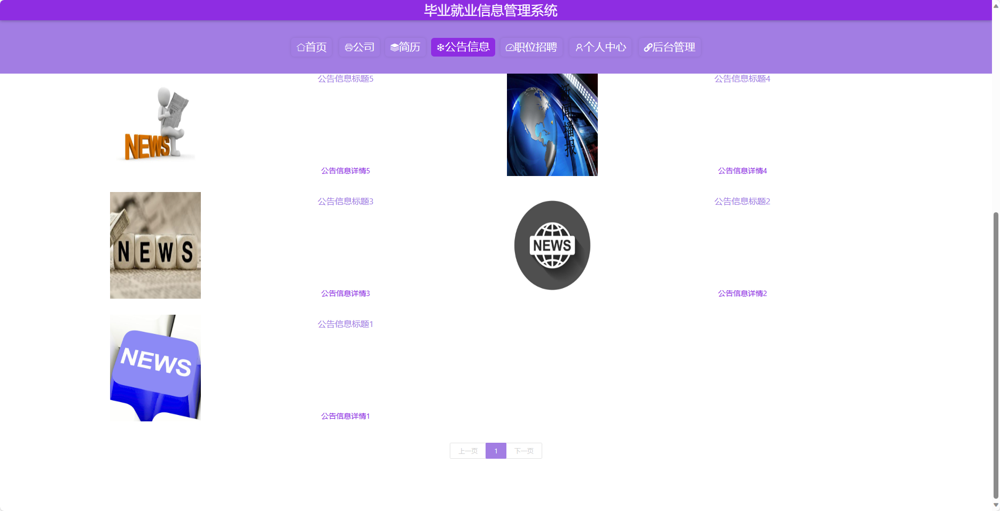
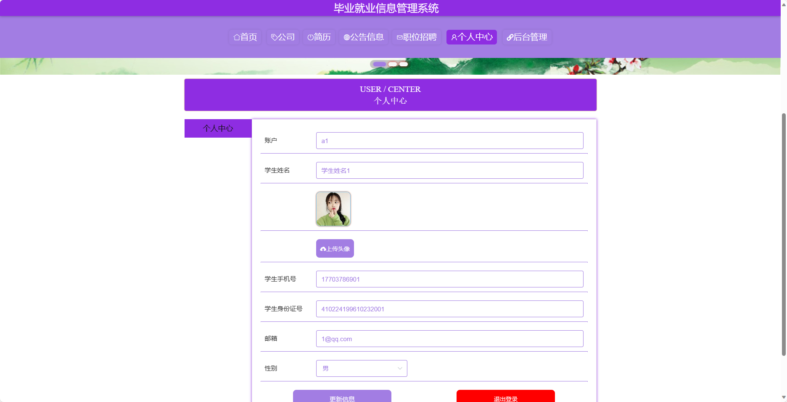
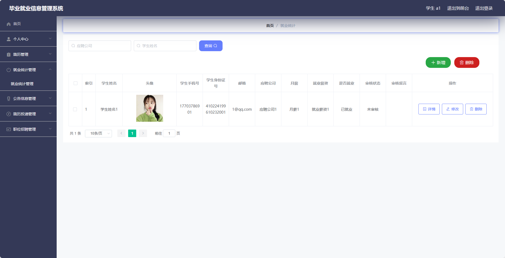
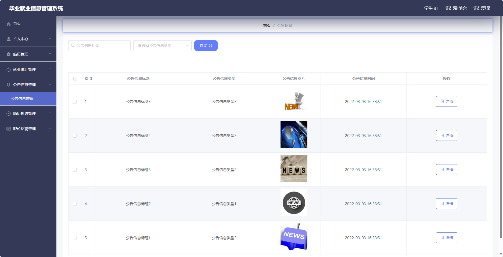
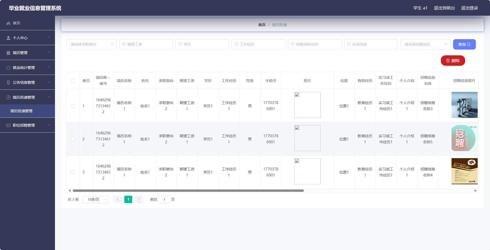
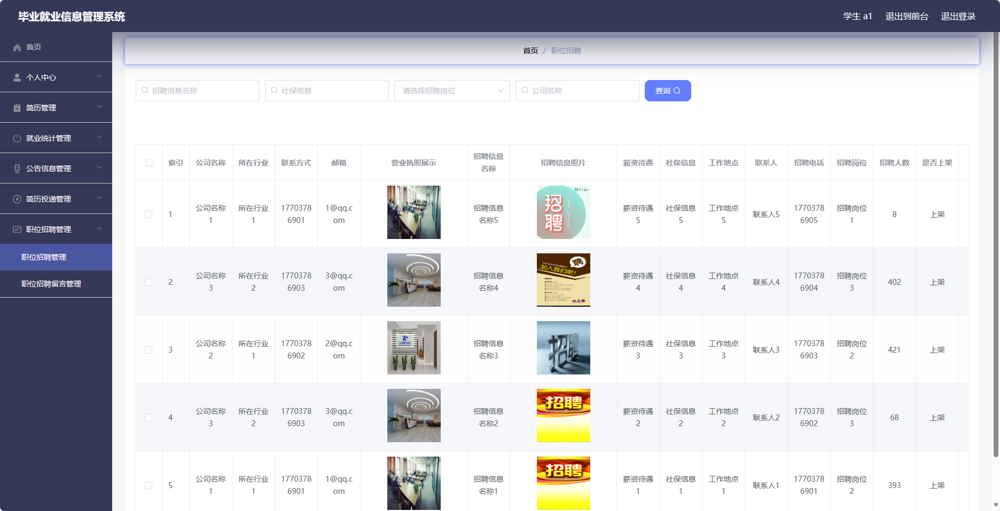

## 基于SpringBoot的毕业就业信息管理系统(程序+报告)

###  获取sql数据库文件: 从戎源码网 (https://armycodes.com/) QQ: 386869957 QQ群: 377586148
###  所有系统地址: (https://github.com/YuLin-Coder/AllProjectCatalog) 
###  所有项目以及源代码本人均调试运行无问题 可支持远程安装部署调试、定制修改、代码讲解

## 项目介绍
基于SpringBoot的毕业就业信息管理系统，系统包含三种角色：管理员、公司、用户,系统分为前台和后台两大模块，主要功能如下。

### 【管理员】:
- 个人中心：管理个人信息。
- 管理员管理：管理其他管理员账号的信息。
- 基础数据管理：管理系统中的基础数据，
- 公司管理：管理招聘公司的信息，
- 简历管理：管理学生上传的简历信息，
- 就业统计管理：统计毕业生的就业情况。
- 公告信息管理：发布和管理最新的就业相关公告信息。
- 简历投递管理：管理简历投递情况，
- 学生管理：管理学生账号信息，
- 职位招聘管理：管理职位招聘信息，
- 轮播图信息：管理系统的轮播图信息，

### 【用户】:
- 个人中心：管理个人信息和简历。
- 简历管理：上传和管理个人的简历信息。
- 就业统计管理：查看和更新个人的就业情况。
- 公告信息管理：查看最新的就业相关公告信息。
- 简历投递管理：查看个人简历投递情况和审核进度。
- 职位招聘管理：查看和申请最新的职位招聘信息。

### 【前台】:
- 首页：展示毕业就业信息管理平台的相关内容。
- 公司：浏览和搜索招聘公司的信息。
- 简历：学生上传和管理自己的简历，进行简历投递。
- 公告信息：查看和发布最新的就业相关公告信息。
- 职位招聘：浏览和搜索最新的职位招聘信息。
- 个人中心：管理个人信息和简历。

## 项目技术
- 编程语言：Java
- 数据库：MySQL
- 项目管理工具：Maven
- 前端技术：HTML、CSS、JavaScript、Jquery、Vue
- 后端技术：Spring、SpringMVC、MyBatis

## 运行环境
- JDK版本：JDK1.8及以上
- 开发工具：IDEA、Ecplise、Myecplise都可以
- 数据库: MySQL5.7及以上
- Maven：maven3.0及以上
- Node：14.14.0及以上

## 运行截图

